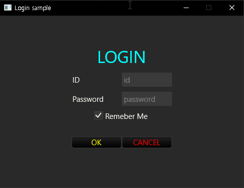

# druid-xml : druid ui builder as xml
* EARLY DEVELOPMENT STAGES

## crates
* [`druid-xml`](https://github.com/markijohn/druid-xml/tree/main/druid-xml) : parse xml and genrate rust code or widget
* [`druid-xml-macro`](https://github.com/markijohn/druid-xml/tree/main/druid-xml-macro) : parse xml and generate rust code
* [`druid-xml-example`](https://github.com/markijohn/druid-xml/tree/main/druid-xml-example) : examples

## Quick Example
* Cargo.toml
```toml
[dependencies]
druid = {git="https://github.com/linebender/druid.git"}
druid-xml-macro = {git="https://github.com/markijohn/druid-xml.git"}
```

* Rust code
```rust
#[macro_use]
extern crate druid_xml_macro;

use druid::{AppLauncher, WindowDesc, Data, Lens};

pub fn main() {
    #[derive(Clone, Lens, Data)]
    struct LoginInfo {
        id : String,
        pwd : String,
        remember : bool
    }

    druid_xml!(
        r#"
        <style>
        #login_label { color:aqua; font-size:2.1em }
        .idpwd_label { width:100px }
        button {width:100px}
        button.ok {width:100px; color:yellow}
        button.cancel {width:100px; color:red}
        </style>


        <flex direction="column" fn="build_main" lens="LoginInfo" axis_alignment="center">
            <label id="login_label">LOGIN</label>
            <spacer/>

            <!-- ID row -->
            <flex>
                <label class="idpwd_label">ID</label>
                <textbox placeholder="id" lens="LoginInfo::id"/>
            </flex>

            <spacer/>

            <!-- Password row -->
            <flex>
                <label class="idpwd_label">Password</label>
                <textbox placeholder="password"  lens="LoginInfo::pwd"/>
            </flex>

            <spacer/>

            <checkbox lens="LoginInfo::remember">Remeber Me</checkbox>

            <spacer/>

            <!-- Button row -->
            <flex style="padding:0px 20px">
                <button class="ok">OK</button>
                <button class="cancel">CANCEL</button>
            </flex>
        </flex>
        "#
    );
    
    let window = WindowDesc::new(build_main())
        .window_size((500., 380.))
        .resizable(false)
        .title("Login sample");
    AppLauncher::with_window(window)
        .launch( LoginInfo { id : "".to_owned(), pwd:"".to_owned(), remember:true } )
        .expect("launch failed");
}
```
* Result



## Try online (include demo)
* [Designer with Demo](https://markijohn.github.io/druid-xml-design/)
* The left panel is the xml code editor, the top right is the real-time wasm reflection panel, and the bottom right is the html rendering. html rendering currently has no meaning, but i plan to make it compatible later.

## Style
<table>
 <thead>
   <td>ATTRIBUTE</td>
   <td>VALUE(example)</td>
   <td>AVAILABLE WIDGET</td>
   <td>DESCRIPTION</td>
 </thead>
 <tbody>
 <tr>
   <td>border</td>
   <td>1 solid black<br/>1px solid yellow</td>
   <td>all</td>
   <td>Only solid brush type is supported</td>
 </tr>
 <tr>
   <td>padding</td>
   <td>5<br/>10 5<br/>10 15 15 10</td>
   <td>all</td>
   <td>(top,right,bottom,left)<br/>(top,bottom) (left,right)<br/>(top) (right) (bottom) (left)</td>
 </tr>
 <tr>
   <td>background-color</td>
   <td>rgb(0,255,255)<br/>rgba(0,255,255,88)<br/>#96ab05</td>
   <td>all(exclude button)</td>
   <td>button not support yet</td>
 </tr>
 <tr>
   <td>color</td>
   <td>rgb(0,255,255)<br/>rgba(0,255,255,88)<br/>#96ab05</td>
   <td>label, button</td>
   <td>text color</td>
 </tr>
 <tr>
   <td>width</td>
   <td>25<br/>25px</td>
   <td>all</td>
   <td>percentage size not yet support(or impossible)</td>
 </tr>
 <tr>
   <td>height</td>
   <td>25<br/>25px</td>
   <td>all</td>
   <td>percentage size not yet support(or impossible)</td>
 </tr>
 </tbody>
</table>

## Widget

<table>
 <thead>
   <td>LOCALNAME</td>
   <td>ATTRIBUTES</td>
 </thead>
 <tbody>
 <tr>
   <td>flex</td>
   <td>must_fill_main_axis<br/>
   flex<br/>
   axis_alignment<br/>
   cross_axis_alignment<br/></td>
 </tr>
 <tr>
   <td>label</td>
   <td>flex<br/>multiline(not yet)</td>
 </tr>
 <tr>
   <td>button</td>
   <td>flex</td>
 </tr>
 <tr>
   <td>checkbox</td>
   <td>flex</td>
 </tr>
 <tr>
   <td>textbox</td>
   <td>flex</td>
 </tr>
 <tr>
   <td>image(not yet)</td>
   <td>flex</td>
 </tr>
 <tr>
   <td>list(not yet)</td>
   <td>flex</td>
 </tr>
 <tr>
   <td>scroll(not yet)</td>
   <td>flex</td>
 </tr>
 <tr>
   <td>slider</td>
   <td>flex<br/>min<br/>max<br/></td>
 </tr>
 <tr>
   <td>spinner(some proble on wasm)</td>
   <td>flex</td>
 </tr>
 <tr>
   <td>split</td>
   <td>flex<br/>split_point<br/>min_size<br/>bar_size<br/>min_bar_area<br/>draggable<br/>solid_bar</td>
 </tr>
 <tr>
   <td>stepper</td>
   <td>flex<br/>min<br/>max<br/>step<br/>wraparound</td>
 </tr>
 <tr>
   <td>switch</td>
   <td>flex<br/></td>
 </tr>
 <tr>
   <td>painter(not yet)</td>
   <td>flex<br/></td>
 </tr>
 <tr>
   <td>container</td>
   <td>flex<br/></td>
 </tr>
 </tbody>
</table>

## TODO
* Load xml from project path
* Animation : CSS `transition`
* Drawable widget : like [`Android Drawable`](https://developer.android.com/guide/topics/resources/drawable-resource)
